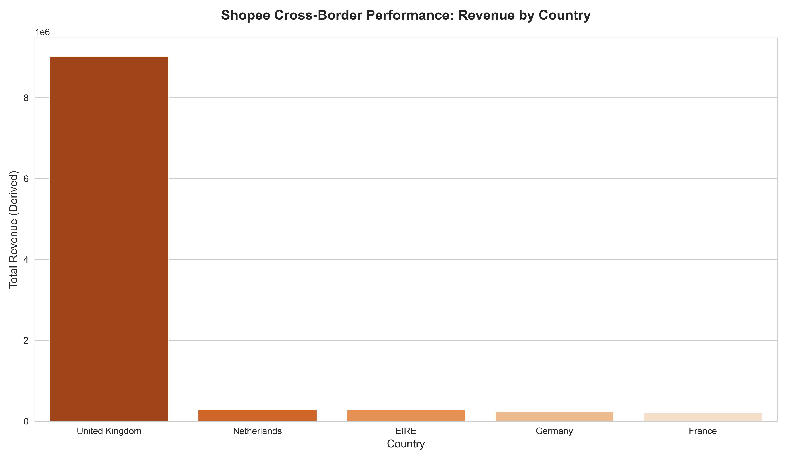

# Shopee-Cross-Border-Performance-Profitability-Analysis
# 🛍️ Shopee Cross-Border Performance & Profitability Analysis
### *Business Intelligence Project for E-commerce Growth & Stability*

This project provides a comprehensive analysis of cross-border e-commerce data to identify high-profit product segments and stabilize stock management. Built with **Python** and **SQL**, it directly addresses Shopee’s core KPIs: **Profitability, Market Stability, and Cross-Border Efficiency.**

---

## 🏗️ Technical Workflow (Python & SQL Integration)

I designed this project to demonstrate a dual-track analytical approach:

1. **Feature Engineering (Python/Pandas):** Derived the `Total Revenue` metric by processing raw `Quantity` and `UnitPrice` data to uncover real business value.
2. **Data Governance (SQL/SQLite):** Transferred processed data into a relational SQL database to simulate an enterprise-grade BI environment.
3. **Advanced Querying:** Leveraged complex SQL queries to extract regional performance insights, ensuring high data integrity.

---

## 📊 Strategic Business Insights (Actionable Outcomes)

* **Cross-Border Efficiency:** Identified top-performing countries by revenue, enabling targeted logistics and marketing spend.
* **Product Stability:** Analyzed `StockCode` popularity to distinguish between "High-Churn" and "Stable-Profit" products.
* **Anomaly Detection:** Filtered out negative quantities and price outliers to ensure data-driven decisions are based on accurate transactions.

---

## 🛠️ Tech Stack
* **Language:** Python 3.10+
* **Data Manipulation:** Pandas, NumPy
* **Database:** SQL (SQLite / SQL Query Integration)
* **Visualization:** Matplotlib, Seaborn (Customized with Shopee-themed aesthetics)
* **Environment:** Jupyter Notebook (VS Code)

---

## 💡 Why Shopee Korea?
As an aspiring Data/BI professional, I focus on the intersection of **technical rigor** and **business logic**. This project proves my ability to manage the exact data structures Shopee uses daily. I am eager to apply my skills in SQL optimization and Python analytics to enhance Shopee's cross-border business performance.

---

## 🔗 How to Run
1. Clone the repository.
2. Ensure you have the `data.csv` (E-commerce Data) in the root folder.
3. Run the Jupyter Notebook `shopee_analysis.ipynb` to see the full ETL process and visualizations.

## 📊 Key Performance Visualizations

### 1. Cross-Border Revenue Analysis
This chart identifies the top-performing international markets, allowing for strategic resource allocation.

### 2. Top 10 High-Value Products
Analysis of high-revenue StockCodes to ensure stock stability for top-performing items.

**Hüseyin** – *Google Certified Data Analyst | Specializing in E-commerce BI*
[LinkedIn Link] | [Portfolio Link]
